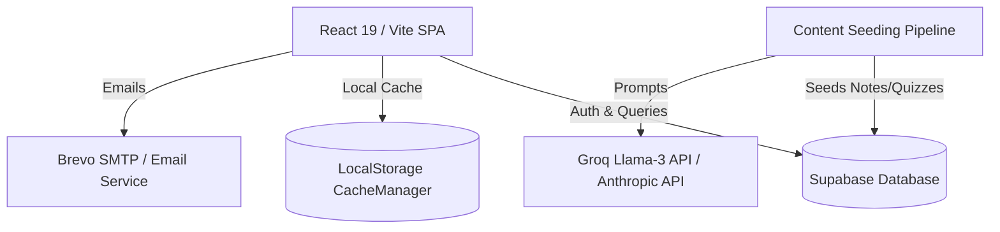
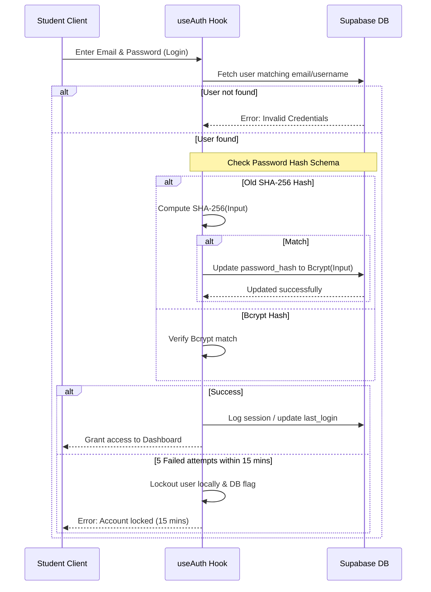
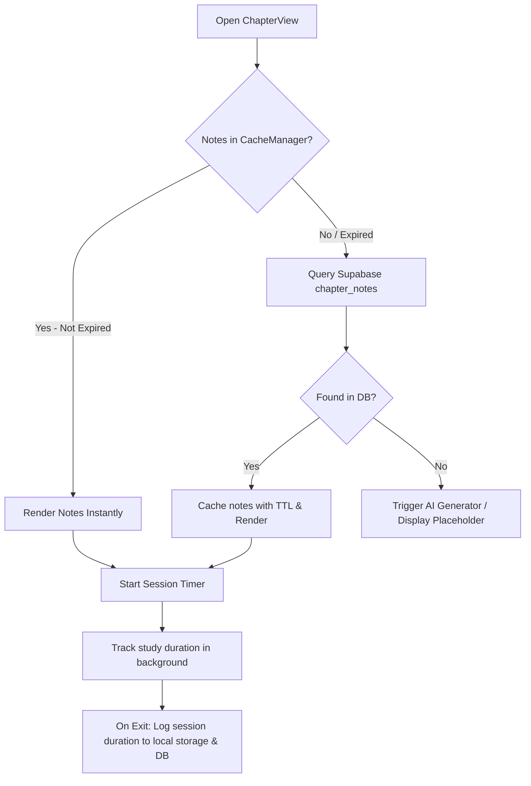

# 🎓 AkmEdu: Technical Architecture, Directory Structure & Logical Workflows

This document provides a single-point-of-reference overview of the **AkmEdu Smart Study Platform** codebase. It covers the technical architecture, directory structure, core data contracts, and key system workflows.

---

## 📂 1. Directory Structure

Below is the directory tree of the AkmEdu platform with details on each module's role:

```
cbse12-platform/
├── public/                 # Static public assets (images, logos, favicon)
├── scripts/                # Root utility and management scripts
│   ├── export-content.js   # Script to export generated content
│   ├── patchLeaderboard.js # Patch script for class-aware leaderboard logic
│   └── makeStatsClassWise.js # Utility to migrate stats storage to class-wise schema
├── supabase/               # Supabase local config, migrations, and schema definitions
└── src/
    ├── main.jsx            # Application entry point (mounts React App)
    ├── App.jsx             # Main application orchestrator (routing, base state, layout)
    ├── App.css             # Root CSS stylesheet
    ├── index.css           # Styling defaults, variables, and typography
    ├── assets/             # SVGs and UI media assets
    ├── constants/          # Application curriculum and static configuration
    │   └── curriculum.js   # Subject, Unit, Chapter mappings for Class 11 and Class 12
    ├── hooks/              # Custom React hooks for state and lifecycle management
    │   ├── index.js        # Hook exports
    │   ├── useAuth.js      # User authentication, OTP, and session monitoring
    │   ├── useNavigation.js# View stack management, back/forward history, scroll state restoration
    │   ├── useProgress.js  # Chapter completion and study progress tracking
    │   ├── useTheme.js     # Light/Dark mode state management
    │   ├── useScrollDirection.js # Emits scrolling direction for UI transitions
    │   └── useKeyboardShortcuts.js # Accessibility shortcuts (ESC, Dashboard navigation)
    ├── styles/             # Shared style tokens and UI layout modules
    │   └── shared.js       # Global theme values, card layouts, animations
    ├── components/
    │   ├── common/         # Shared presentation elements
    │   │   ├── Badge.jsx             # Gamification reward component
    │   │   ├── ExamTimer.jsx         # Countdown timer for exam papers
    │   │   ├── SearchBar.jsx         # Custom search engine for units, chapters, and topics
    │   │   ├── StreakDisplay.jsx     # Visual indicator for continuous daily study activity
    │   │   ├── WeeklyToppers.jsx     # Showcases weekly leaderboard leaders
    │   │   ├── ForumModal.jsx        # Q&A board discussion view
    │   │   ├── ImageUploader.jsx     # Profile photo handling
    │   │   ├── LoadingScreen.jsx     # Overlay for long-running processes
    │   │   ├── ProgressBar.jsx       # Standard progress bar
    │   │   ├── RankBadgeDisplay.jsx  # Tiered gamified rank graphics
    │   │   └── WeakTopicsReport.jsx  # Visualization of error-prone syllabus topics
    │   └── views/          # Screen-level views rendered conditionally by App.jsx
    │       ├── AuthView.jsx          # Login, signup, password-reset, and OTP verification screen
    │       ├── DashboardView.jsx     # Student launchpad containing stats summaries and recent activity
    │       ├── SubjectView.jsx       # Subject navigation showing Units, Chapters, and Mock Papers
    │       ├── ChapterView.jsx       # Chapter interface prompting notes reading or practice tests
    │       ├── NotesView.jsx         # Formatted text viewer for studied topics
    │       ├── QuizView.jsx          # Interactive exam runner (practice MCQs)
    │       ├── QuizSetsView.jsx      # Lists sets of quizzes available per chapter
    │       ├── LeaderboardView.jsx   # Top-performing students ranking lists
    │       ├── ProfileView.jsx       # User profile manager, password update, statistics, achievements
    │       ├── ProgressView.jsx      # Visual map of syllabus completion status
    │       ├── StatsView.jsx         # Advanced session duration tracking, hourly activity, mastery trends
    │       └── PipelineDashboardView.jsx # Developer monitor for content generation status
    ├── utils/              # Client-side processing and services
    │   ├── api.js          # API callers (includes fallback to Anthropic/Claude SDKs)
    │   ├── auth.js         # Encryption handlers, password validation, and bcrypt utility
    │   ├── badges.js       # Reward triggers (checking progress metrics to assign badges)
    │   ├── bookmarks.js    # Notes and quiz bookmark lists
    │   ├── cacheManager.js # LocalStorage wrapper with auto-expiry (TTL) and LRU size protection
    │   ├── emailService.js # Email sending interface via Brevo client SDK
    │   ├── emailVerification.js # Verification token and OTP expiration manager
    │   ├── forum.js        # Forum communication logic (posts, comments, voting)
    │   ├── gamificationDB.js # User level, XP calculations, and achievement synchronizers
    │   ├── imageCompression.js # Resizes and compresses avatars client-side
    │   ├── leaderboard.js  # Leaderboard DB queries with localized cache
    │   ├── loginStreak.js  # Streaks database updater
    │   ├── passwordValidation.js # UI feedback validation logic
    │   ├── performanceMonitoring.js # Custom Console-based performance logger
    │   ├── queryOptimization.js # DB request deduplicator
    │   ├── quizUtils.js    # Sanitizer and validator for generated quiz questions
    │   ├── rateLimiting.js # Throttle and debounce counters for UI-heavy events
    │   ├── recentChapters.js # LRU tracking of recently opened modules
    │   ├── sessionTracking.js # Tracks active study session timers and maps recommendations
    │   ├── streaks.js      # Streak check algorithms
    │   ├── supabase.js     # Main database interface clients and operations
    │   └── weakTopics.js   # Analytics engine sorting wrong answers into revision tasks
    └── content-pipeline/   # Backend content generator pipeline
        ├── keyPool.js      # Multi-credential manager for Groq / OpenAI keys
        ├── queue.js        # Generation job pipeline controller
        ├── scheduler.js    # Scheduler triggering generators
        ├── exports/        # Content packager module
        ├── generators/     # AI prompt engines for notes/quizzes/papers
        ├── validators/     # Format and safety checkers
        └── workers/        # Process threads for async generation
```

---

## 🏛️ 2. Architectural Design & Tech Stack

AkmEdu is structured as an **Edge-cached Client-Server Single Page Application (SPA)**. Below is the system stack breakdown:



### Stack Components:
1. **Frontend (SPA)**:
   - **React 19 & Vite**: Component-based user interface using optimized ESM builds.
   - **State Routing**: `useNavigation` hook operates a virtual page-stack history on top of React state (avoiding complex router boilerplate and enabling smooth view transitions).
   - **Styling**: Vanilla CSS utilizing CSS Custom Properties (`--bg-primary`, `--accent-color`, etc.) for dark/light themes. Includes premium gradients and frosted Glassmorphism backdrops (`backdrop-filter`).
2. **Backend Services**:
   - **Supabase**: Serves as the database (PostgreSQL) and Auth provider. Utilizes Postgres Row-Level Security (RLS) for data isolation.
   - **Brevo SDK**: Powers transactional OTP, email verification, and password resets directly through the user client / Edge functions.
   - **Groq & Anthropic Claude APIs**: Fuel the background content generation pipeline that populates practice questions, syllabus notes, and mock board papers.
3. **Caching Layer**:
   - **Local Storage Cache Manager**: Intercepts queries to Supabase. Notes and Quiz structures are serialized, timestamped, and stored locally with strict Time-To-Live (TTL) expirations and automatic cleanup if local storage space is exhausted.

---

## 🔄 3. Core Logical Workflows

### 🔐 A. Authentication & Security Flow
This flow ensures strong passwords, protects against brute-force logins, and upgrades user security schemas transparently.



### 🧭 B. Navigation & View Routing Flow
The routing system is non-intrusive and implements a memory-efficient back-history buffer that restores page scroll positions when backing up.

*   **Stateful Page Stack**: The `useNavigation` hook contains a state list of visited views: `viewStack = ['dashboard', 'subject', 'chapter']`.
*   **Transitions**: Going forward appends a view. Going backward pops the stack.
*   **Scroll Preservation**: Before a view changes, the current page offset is registered. When popped, `useNavigation` triggers a micro-delayed `window.scrollTo()` to restore the student's exact reading position.
*   **Class level Switching**: Switching class (Class 11 vs Class 12) overrides the active curriculum file, resetting the navigation stack to avoid fetching mismatching chapters.

### 📚 C. Notes & Quiz Study Flow
When a user navigates to a chapter, the system prioritizes offline local storage, queries database caches, and logs study time.



### 🏆 D. Gamification, Streaks & Leaderboard
Daily engagement is driven by custom gamification hooks tracking XP, login streaks, and leaderboard positions.

1.  **Daily Streak Assessment**:
    *   On dashboard load, `recordDailyActivity` is called.
    *   It checks the last recorded login timestamp in `akmedu_streaks`.
    *   If the difference is under **24 hours**, the streak continues. If between **24 to 48 hours**, the streak increments. Beyond **48 hours**, the streak resets to 1.
2.  **XP and Leveling**:
    *   Completing a Quiz awards **100 XP** base + bonus points based on score accuracy.
    *   XP updates trigger level recalculation: `Level = Math.floor(Math.sqrt(Total_XP / 100))`.
    *   Unlocking levels triggers achievements displayed in ProfileView.jsx.
3.  **Leaderboard Upgrades**:
    *   Leaderboard rankings fetch high scores for specific subjects/chapters class-wise (`class_level` = "11" or "12").
    *   Caches are maintained per subject/chapter level to prevent overloading DB read calls.

### 📊 E. Analytics, Performance & Recommendations
Student inputs are analyzed by a client-side computation engine to determine weak spots.

*   **Quiz Feedback**: When a quiz is submitted:
    *   `recordQuizSubmission` isolates wrong answers.
    *   It maps the wrong question to its syllabus topic (e.g., "Electrostatics -> Coulomb's Law").
    *   The topic's failure score incrementer is saved in `akmedu_weak_topics`.
*   **Stats Dashboard**:
    *   Parses session durations to calculate average study times and peak study hours.
    *   Yields personalized recommendations (e.g., *"You've been struggling with Coulomb's Law. Spend 15 minutes reviewing notes in Physics Unit I."*).

---

## 🛠️ 5. API & Database Schema Overview

### Supabase Core Tables:
*   **`users`**:
    *   `username` (text, Primary Key)
    *   `email` (text, Unique)
    *   `password_hash` (text)
    *   `name` (text)
    *   `created_at` (timestamptz)
    *   `last_login` (timestamptz)
    *   `xp` (integer)
    *   `level` (integer)
*   **`quiz_submissions`**:
    *   `id` (uuid, Primary Key)
    *   `username` (text, Foreign Key)
    *   `class_level` (text) - "11" or "12"
    *   `subject` (text)
    *   `chapter` (text)
    *   `score` (integer)
    *   `total_questions` (integer)
    *   `wrong_topics` (text[])
    *   `created_at` (timestamptz)
*   **`chapter_notes`**:
    *   `id` (uuid, Primary Key)
    *   `class_level` (text)
    *   `subject` (text)
    *   `chapter` (text)
    *   `content` (text)
    *   `created_at` (timestamptz)
*   **`forum_posts`**:
    *   `id` (uuid, Primary Key)
    *   `username` (text)
    *   `title` (text)
    *   `content` (text)
    *   `upvotes` (integer)
    *   `created_at` (timestamptz)
